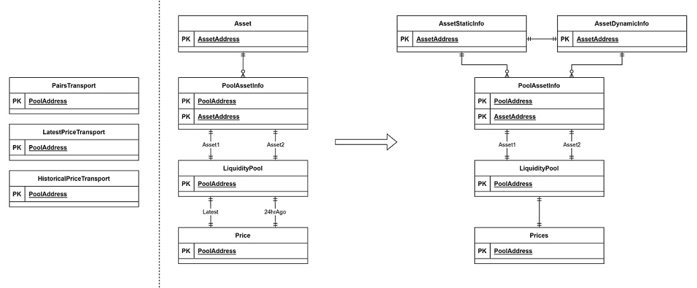

# CoinHallCopy
An example project to demonstrate my personal development style, using https://coinhall.org/ as a reference. This is a minimal copy of the project that displays token metrics from the Terra Luna ecosystem. The webapp cannot be viewed live on Github Pages as Coin Hall has enabled CORS, but can be viewed locally on localhost; follow the `Quick Start` guide.


This project was bootstrapped with [Create React App](https://github.com/facebook/create-react-app), and modified to suit Terra's [Wallet Provider](https://github.com/terra-money/wallet-provider) component.

## Table of Contents
1. [Quick Start](#Quick-Start)
2. [Architecture](#Architecture)
3. [Managing Application State](#Managing-Application-State)
4. [Development Style](#Development-Style)

---

## Quick Start
```
// Install Packages
yarn

// Execute Lint
yarn lint

// Execute Tests
yarn test

// Start the webapp locally
yarn start
```

### Available Scripts
Refer to ```package.json```, for the list of available commands.

---

## Architecture
This being a frontend project, we have to work with the endpoints available to us.

```
/v1/charts/terra/pairs
/charts/terra/prices/latest
/charts/terra/prices/historical
```

We can take the data schema given to us and draw up our own Entity-Relationship diagram as follows:



Each of the endpoint's response are represented by the `Transport` entities. We can then remodel them to suit our frontend needs. The `LiquidityPool` entity has two different prices associated with it: the latest price, and the previous 24hr price. The `LiquidityPool` also has two assets that form a pair in the pool. Those assets have their own pool information attach to them such as amount of tokens in the pool, and are represented as `PoolAssetInfo` entity. Each `Asset` entity may be part of multiple `PoolAssetInfo` entities, as an asset can have multiple liquidity pools.

We can further remodel the ER diagram by investigating how the data changes over time. For instance, the latest price and the historical 24hr price should be updated at the same time. We can remodel the `Price` entity to a `Prices` entity that encapsulates both the latest and historical 24hr price. On the other hand, the Asset entity can be split into two: `AssetStaticInfo` and `AssetDynamicInfo`. An Asset has data that should remain unchange over time such as the name, contract address, and social media links, while also having data that may change regularly such as the circulating supply.

This final ER diagram forms the backbone of our frontend application.

---

## Managing Application State

We will use React's ```useContext```, ```useState```, and other relevant hooks to manage and store the application state, which can be visually represented using indentations as shown below. For full details refer to [CoinHallProvider.tsx](src/contexts/CoinHallProvider.tsx).
```
CoinHallAssetDynamicContext
  CoinHallAssetStaticContext
    CoinHallPoolDynamicContext  
      CoinHallPoolStaticContext  
        CoinHallMethodContext
          App
```

The application will be wrapped by the various contexts, allowing the application components to pull data and methods as needed. All methods / functions will be stored in the `CoinHallMethodContext` component as their execution do not change over the product lifecycle. Each of the entities has a separate `static` and `dynamic` context, allowing isolated rendering of individual components in the application. This leaves room for exapansion in our frontend project, as future objects can be slot in as needed to the right context or even having their own context.

### Cache

Currently, Coinhall uses `IndexDB` to cache their network requests. This project uses `localstorage` instead, as it is less complex and sufficient for the current set of use cases.

---

## Development Style
### Test-Driven Development with RTL & Cucumber

Navigating to ```src/__tests__``` , one can see that the tests are written in a way that mimics the actual `User Story`. This acts as a contract between developers and the product owner as to what features have been completed, and will carry on to exist throughout the product lifecycle. There are no unit tests in this project as they do not provide any value to the product; unit tests act as a medium of communication between developers and will be dependent on internal best practices made by the team. With `React Testing Library (RTL)`, writing `User Story` tests that mimics actual user behavior is made possible, while also being able to execute as fast as how traditonal unit tests do.

There are limitations to using `RTL` such as testing components that do not exist on the `JSDOM`. An example would be Terra's `Wallet Connect` components. In this scenario, mocking out the entire components would be used instead as we trust that the components are made functional and secured by Terra. We can then simply test that the mocked component has been rendered.

